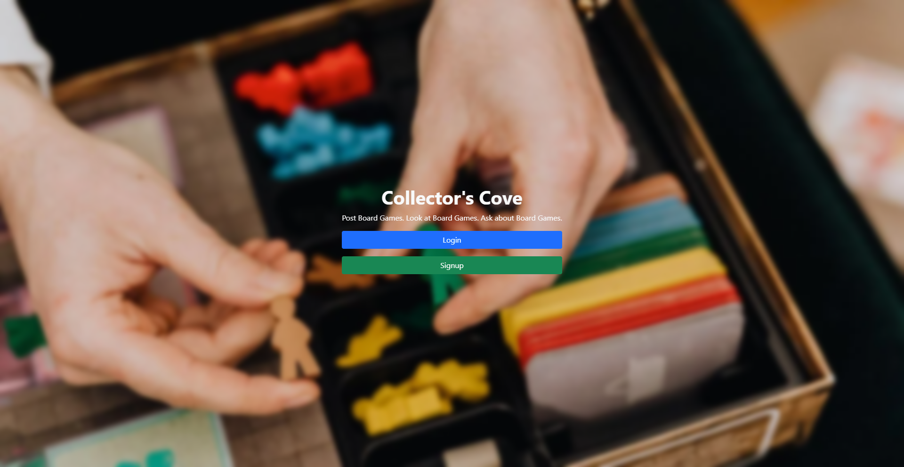

# Collector's Cove

This is a place for Board Game Collectors to get together, and share photos with each other about the various board games they have in their collections, they can also like, and comment on posts from others.

**Link to project:** https://collectors-cove.onrender.com/

## How It's Made:

**Tech used:** HTML, CSS, JavaScript, EJS, Node.js, Express, MongoDB, Mongoose, bcrypt, cloudinary, dotenv, express-session, morgan, multer, passport

Node.js takes care of the backend, and MongoDB is the database used. Express helps to set up the API, and tells where to go when something is clicked. Cloudinary is used for saving uploaded photos. Mongoose is for the database schema. bcrypt to help with keeping user's passwords encrypted. Morgan to log to the console what requests are being sent. Multer to assist in uploading files. Express-session to keep the user logged in when coming back to the site. Passport for login methods.

## Optimizations

- It could definitely look better, in the future I'd like to clean up the design of the page to make it more appealing.[^1]
- Adding user's names to comments. [^2]
- Adding Post Titles to the Feed[^3]
- Switching out EJS for React.[^4]
- Work on Responsiveness Layout[^5]
- (Further Down the Road) Profile Photos, Information, Friendlists Etc[^6]

## Lessons Learned:

- While going through this application I learned more about Bootstrap, and how to make things look nice.
- Adding Authentication to Applications, so users can login, and signup for the website using their own user names and passwords.
- Adding Encryption to Passwords for User Safety and Protection
- Adding/Retrieving Users, Passwords, and Notes from the MongoDB database
- Linking Cloudinary for users to upload photos.

[^1]: I need to continue to tweak Bootstrap, as well as the CSS to give it a professional appearance.
[^2]: The next step is to make it so User's Names will appear next to their comments.
[^3]: I also want to have it so post titles will appear above each "post".
[^4]: When I have time I'd love to switch everything from EJS into React.
[^5]: This is going along with [^1] I want to clean up the responsiveness layout of the entire thing, so in smaller screens it looks prettier.
[^6]: Eventually I'd love to make the profiles have pictures for each person, as well as some information about them that others can see, and adding the ability to add people as friends.
